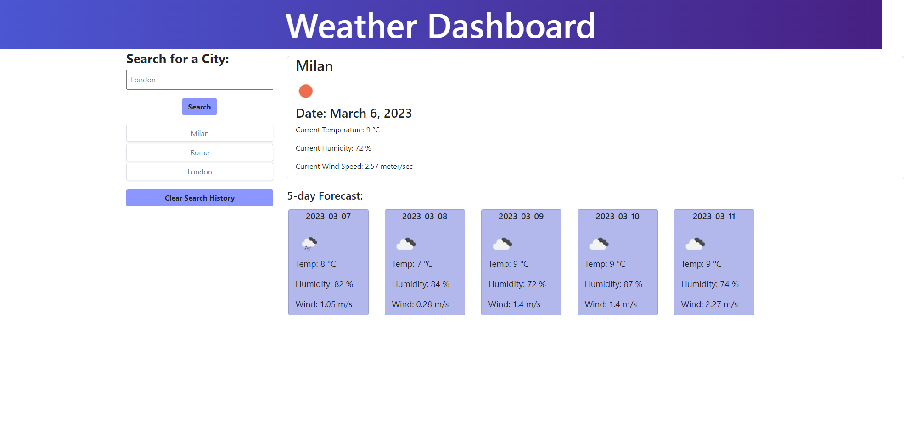

# WEATHER DASHBOARD

## Introduction

Webpage deployed at:  https://bh00fie.github.io/DailyPlanner/

Server APIs allow developers to access their data and functionality by making requests with specific parameters to a URL. Developers are often tasked with retrieving data from another application's API and using it in the context of their own. The objective of this project is to build a weather dashboard that will run in the browser and feature dynamically updated HTML and CSS depending on the user input.

## Description

The app should:
- Create a weather dashboard with form inputs.
- When a user searches for a city they are presented with current and future conditions for that city and that city is added to the search history.
- When a user views the current weather conditions for that city they are presented with:
- The city name
- The date
- An icon representation of weather conditions
- The temperature
- The humidity
- The wind speed
- When a user views future weather conditions for that city they are presented with a 5-day forecast that displays:
- The date
- An icon representation of weather conditions
- The temperature
- The humidity
- When a user clicks on a city in the search history they are again presented with current and future conditions for that city.

JS file has been commented on to help understand written code if interested in looking into it more in-depth.
The code has been deployed on the following webpage:  https://bh00fie.github.io/DailyPlanner/

## Final Results
When you open your code in the browser my resulting quiz should look similar to the following:

- Result:

---

## License

MIT Licence

---

© 2022 edX Boot Camps LLC. Confidential and Proprietary. All Rights Reserved.